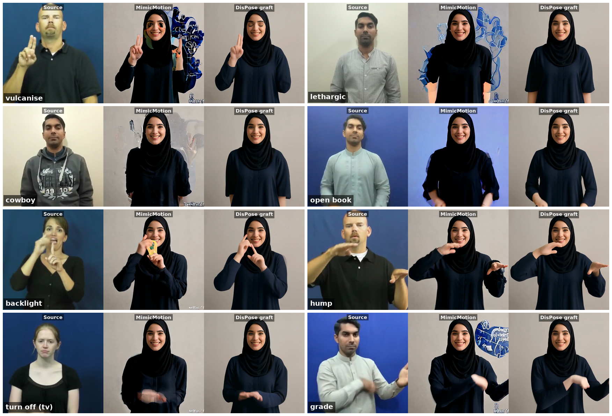

# Qualitative comparison — sign-driven MimicMotion vs DisPose

> Goal: establish the baseline generation configuration for downstream work on
> the hardest content (sign language, fine-grained hand motion).
> Compared: sign-language MimicMotion (jubail2 fork, graft built in) vs DisPose
> (with the graft module ported as a switch).
> Dates: 2026-07-04 – 07-05. Env: Jubail A100 (zl6890 = DisPose / yf23 = MimicMotion).

---

## 1. Motivation and background

- Sign-language clips (how2sign) are used as the driving source: fingers are the
  acknowledged hardest content for pose-driven generation, so they best separate
  control schemes.
- The sign-language MimicMotion on jubail2 is a modified upstream whose pose
  preprocessing contains `graft_pose_v2` (in-house): starting from the reference
  image's pose (body / face / legs frozen), it transplants only the driving
  video's **arm (elbow/wrist) + hand** keypoints, scaled by the shoulder-neck
  distance ratio, plus a 15% head blend (nose/eyes/ears; >0.20 introduces
  artifacts). This is the identity-preservation mechanism for cross-identity
  sign generation.
- For a fair comparison, `graft_pose_v2` was ported into DisPose as a **switch**,
  so both sides share the same pose-conditioning construction.

### Key code facts (important for reading the results)

- DisPose's motion-field branch (traj_flow / CMP dense flow / point embedding)
  uses **only the 18 body keypoints**; the finger keypoints that DWPose detects
  are dropped (`preprocess.py` only collects `bodies`/`faces`). Finger
  information exists only in the skeleton-image branch shared by both models.
  → Any hand difference is an **indirect** effect of the motion field.
- The graft switch (`graft_pose: true`) applies to both the skeleton image and
  the motion-field point list, keeping the control chain self-consistent.

## 2. Implementation and materials

| item | content |
|---|---|
| graft port | `mimicmotion/dwpose/graft.py` (ported line-by-line from the jubail2 fork); wired via `get_video_pose(graft=)`; config field `graft_pose` (default false, exact original behavior) |
| driving videos | 3 how2sign 8 s clips: `1aRNY8wFqa0_32-8`, `5ok8y3eheq8_7-1`, `DI6T6tbk3r0_15-5` (all 192 frames; first two 24 fps, third 23.976 fps, 0.1% error ignored). In `assets/example_data/sign_videos/` |
| reference image | `test2.jpg` (same as the jubail2 batch, cross-identity); spares `ref_01~05.png` (identity experiments, copied into refs/) |
| shared params | 25 steps / CFG 2.0 / tile 16 / overlap 6 / seed 42 / square 576 / noise_aug 0 |

Note: in how2sign, `CanYlZX_uyE_6-5` is corrupt at source (missing moov atom;
md5 matches the remote, confirming the source itself is broken) — discarded.

## 3. Experiment 1: graft switch smoke test (15 fps / stride 2)

**Protocol**: DisPose graft on vs off, 3 cases, all other params identical
(output 96/97 frames @15 fps). Jobs: jubail 16502243 (on) / 16502244 (off), two
A100s in parallel, ~4-5 min denoising per case.

**Results** (`outputs/sign_graft_smoke/graft_on|graft_off/`):

| dimension | graft on | graft off |
|---|---|---|
| identity | face/head firmly locked to reference | **clear identity drift** (head follows driver; by t≈5 s the face no longer resembles the reference) |
| motion transfer | arm + hand correctly followed | whole body followed (incl. unwanted torso/head motion) |
| hand shape | slightly cleaner | normal |

**Reading**: switch behaves correctly; graft is a required component for the
cross-identity setting.

## 4. Experiment 2: aligned three-way comparison (24 fps / stride 1, main run)

**Protocol**: all 192 source frames drive the generation (stride 1), output
fps 24 → **frame-for-frame aligned and iso-speed with the source**.
- DisPose graft on: jubail 16507781, config `configs/early/test_sign_align.yaml`
- MimicMotion sign version: jubail2 16507783, `batch_process.py --sample-stride 1 --fps 24`, other params matched
- Frame counts: source 192 / DisPose 192 (internal +1 reference frame, dropped on save) / MimicMotion 193 (padding off-by-one, **first frame trimmed when stitching**)

**Deliverable**: `outputs/sign_cmp_aligned/cmp_*.mp4` (3 clips, 1728×576,
three-panel = Source | MimicMotion | DisPose graft, source centre-cropped square
+ drawtext labels, all H.264; single-model raw outputs under `raw/`).

**Qualitative conclusion (user review, 2026-07-05)**: **DisPose + graft on is
best**, adopted as the baseline for later work.

| dimension | MimicMotion (sign version) | DisPose + graft |
|---|---|---|
| finger structure | smearing/fusion under motion (e.g. left hand blurs on crossed-finger frames) | **largely reconstructs the source hand shape** |
| artifacts | recurring text-like watermark artifact at the bottom of the frame | none |
| identity | good (graft built in) | good (ported graft works) |

**Observation (worth putting in the paper)**: DisPose's motion field contains no
finger keypoints, yet hand shape is systematically better → dense-flow control of
the arm/wrist trajectory **indirectly** stabilizes hand-region generation.
Combined with the graft logic itself (which laboriously retargets hands at the
skeleton layer precisely because there is no dedicated hand-motion control
channel), "hand control is absent in the current motion-field scheme" is direct
motivation material for the SIREN/step3 direction.

## 5. Engineering notes

- Two-account split: DisPose @ jubail (zl6890), sign MimicMotion @ jubail2
  (yf23, `chatsign-175/MimicMotion/zhewen_cmp/`); jubail2 has no DisPose repo.
- Every sbatch must carry `--mail-type=ALL --mail-user=zh3510@nyu.edu`; login-node
  slurm commands need `bash -lc`.
- MimicMotion output is mpeg4 (VS Code can't play it); re-encode to H.264 after
  pulling back (`libx264 -crf 16 -pix_fmt yuv420p`).
- Local↔cluster link is unstable: mux sockets break (delete `~/.ssh/sockets/*`
  and rebuild); transfer large files with `rsync --partial` over multiple retries
  + **md5 verification** (silent truncation has occurred).
- In old jubail2 scripts `ROOT=/scratch/yf23/MimicMotion` is stale; the real path
  is under `chatsign-175/`.

## 6. Next steps (pending scale decision)

1. Formal qualitative run: pick 10~15 from how2sign_100 (cover signers / speed /
   hand-shape complexity: crossed hands, fingerspelling, etc.);
2. Keep the three-panel deliverable (graft-off identity drift already settled in
   the smoke run, no need to rerun per clip);
3. Add 1~2 more `ref_0x` reference images to verify the conclusion is not
   identity-specific;
4. Return to the SIREN/step3 main line, using **DisPose + graft** as the baseline
   to build on.

## 7. Experiment 3: hard27k 15-clip run + MimicMotion failure grid (2026-07-05)

Fulfils the scale half of §6-1, with asl27k contested-review words instead of
how2sign (harder content, and the same pool the later 109-clip quantitative run
draws from). Recorded retroactively 2026-07-11 — the run originally lived only
on the huawei disk.

**Protocol**: 15 hard-case clips (asl27k rejected-review words, sources
committed at `assets/example_data/sign_videos/hard27k_orig/`), original signer
videos (640×360 @29.97) as driver, `test2.jpg` reference, stride 1 / fps 30 /
CFG 2.0 / 25 steps / 576 / seed 42 — the aligned §4 protocol. DisPose+graft via
`configs/hard27k/test_sign_hard27k.yaml` (5 clips) + `_b2.yaml` (10 more) on jubail
(outputs `20260705_test_sign_hard27k*`); MimicMotion sign version on jubail2
(`zhewen_cmp/outputs_hard27k_orig*`). These 15 are the first batch of the 109
used in `quantitative.md` (`_c1..c4` complete the set).

**Deliverables** (`outputs/sign_cmp_hard27k/`, synced huawei → Mac 2026-07-11):
15 three-panel `cmp_*.mp4` (Source | MimicMotion | DisPose graft), single-model
raw outputs under `raw/{dispose,mimicmotion}/`, and the failure grid
`figs/mm_failures_grid.png` (also committed at
[`figs/mm_failures_grid.png`](figs/mm_failures_grid.png)):

8 hand-picked source-frame instants, three panels each; word ↦ clip:frame =
vulcanise `0bsujxxpwd:425`, lethargic `07imqjgcxc:99`, cowboy `05tcw2nou9:64`,
open book `0byrxo0heb:56`, backlight `0db3uk2cqw:150`, hump `0bcxsenqga:174`,
turn off (tv) `0ihmqp5iz6:28`, grade `0ejbehccd4:23`. Frames were extracted
from the cmp videos with an ad-hoc ffmpeg script (huawei session, not kept);
the protocol is now codified in `scripts/hand_pilot/make_qual_grid.py`, which
rebuilds the same layout with the SIREN system as the third panel (see
`../siren_hand/qualitative.md`).

**MimicMotion failure taxonomy visible in the grid** (DisPose+graft shows none
of these):

1. **Text/watermark artifact bursts** — dense blue glyph clusters erupt around
   the subject (vulcanise, lethargic, grade); the source corpus' watermark
   memorized and re-emitted.
2. **Source-background leakage** — the whole background flips to the driver's
   blue backdrop (open book).
3. **Hallucinated objects** — a yellow card-like object materializes in the
   hand (backlight).
4. **Arm stumps** — forearms amputate into skin-colored stubs (lethargic).
5. **Blob/claw hands under motion** — fingers fuse or smear on fast frames
   (cowboy, hump, turn off), consistent with §4's finding.

This is the qualitative ground the FVD gap (830 vs 907, `quantitative.md`)
stands on, and the per-failure quantification backlog there (OCR text-artifact
rate, background leakage) indexes exactly failures 1–2.
