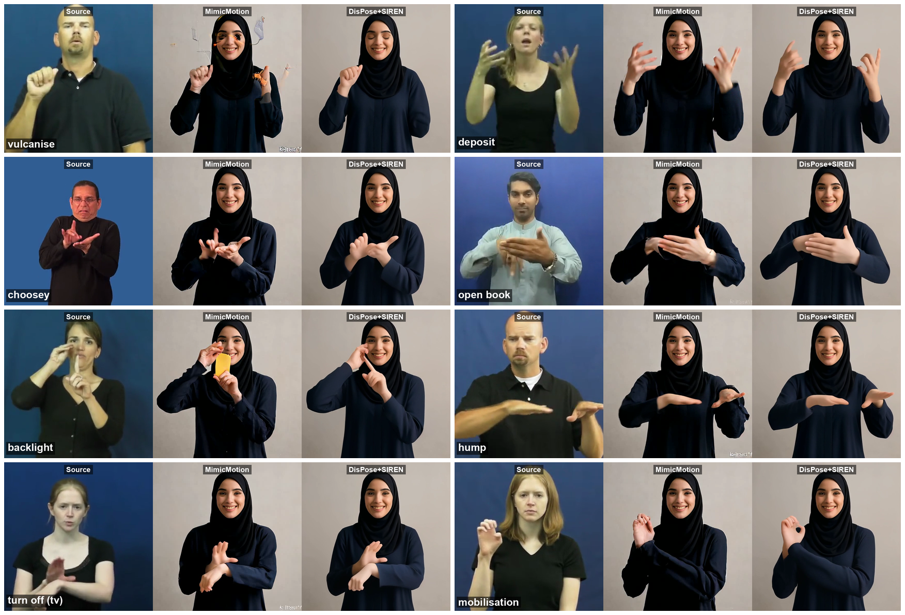

# 定性对比:MimicMotion vs DisPose+graft+SIREN(grid figure)

> `siren_module.md` §5 两张定量表的配套定性图:在 8 个 asl27k 难例词条上,
> 同一源时刻三画幅并排(Source | MimicMotion | DisPose+SIREN)。
> 日期:2026-07-11。脚本:`scripts/hand_pilot/make_qual_grid.py`(本地 Mac,
> ffmpeg 抽帧 + PIL 排版;本地 homebrew ffmpeg 无 drawtext,故不用 filter 排版)。



图:`figs/mm_vs_siren_grid.png`(同份在 `outputs/sign_cmp_hard27k/figs/`)。

## 1. 材料与对齐口径

| 列 | 来源 | 帧对齐 |
|---|---|---|
| Source | `assets/example_data/sign_videos/hard27k_orig/{id}.mp4`(640×360,中心裁方) | 帧 n |
| MimicMotion | P2 全量跑(jubail2),本地副本 `outputs/sign_cmp_hard27k/raw/mimicmotion/` | **帧 n+1**(输出首帧是 padding,501 vs 源 500 帧,实测核对) |
| DisPose+SIREN | **best-of-≤3** 交付(集群 `outputs/sign_siren_best/best/`,8 条已拉回本地同名目录) | 帧 n(内部参考帧存盘时已丢,逐帧对齐) |

与 §5.2 同一批生成视频、同一 best-of 选择;三列取**同一源时刻**,不做逐列
挑帧,可作配对对比读。

## 2. 选帧协议(showcase,须披露)

clip 池 = hard27k 15 条 pilot(`baseline/qualitative.md` §7;实际可用 12 条:
podia 的 SIREN mp4 传输损坏,2 条无词标签)。两阶段:

1. **候选帧 = SIREN 视频的运动低谷**(64×64 灰度帧差 + 5 帧平滑,取局部
   最小、间隔 ≥12 帧)——手语"驻留"时刻,手形定格、无运动模糊。首版直接
   沿用 `mm_failures_grid` 的帧号,SIREN 列多为快动帧、手糊,被否。
2. 候选帧接触表(Source/MM/SIREN 三行)目检,判据 = **同一源时刻 MM 失败
   明显 且 SIREN 手形清晰**;MM 在驻留帧不烂的 clip 整条弃用
   (cowboy/grade/lethargic 因此出局,换入 deposit/choosey/mobilisation)。

| 词条 | clip:帧 | MM 失败 | SIREN 手形 |
|---|---|---|---|
| vulcanise | `0bsujxxpwd:446` | 文字/涂鸦爆发 + 橙色碎块 | 捏合手定格 |
| deposit | `03os6hy28y:15` | 双手爪形绞成团 | 双手弯指根根分明 |
| choosey | `0gjpljgpdj:33` | 双手手指互缠 | 双拇指手形干净 |
| open book | `0byrxo0heb:44` | 指间黑糊块 + 背景泛蓝 | 张开五指罩掌 |
| backlight | `0db3uk2cqw:161` | 手中幻觉黄色物体 | 指点掌心清晰 |
| hump | `0bcxsenqga:117` | 手指黏连成板 + 右手爪 | 平掌五指分明 |
| turn off (tv) | `0ihmqp5iz6:59` | 腕上团爪 | L 形手搭腕 |
| mobilisation | `0hwhrmyqqx:98` | 面前爪团 | 圆环(OK)手形 |

**披露口径(论文 caption 必须带)**:定性图为 showcase——clip 取 MimicMotion
失败典型例,帧取 SIREN 驻留时刻并人工挑选;SIREN 列 = best-of-≤3 seeds 按
DWPose 手部置信度重排(与 §5.2 同一披露)。总体分布性结论以
`siren_module.md` §5 的 109 条配对统计为准(mean_hand_conf 101/109,
p=6.4e-22)。

## 3. 读图要点

- 8 格 SIREN 列全部是**定格清晰的手形**;MM 列同一时刻覆盖其失败 taxonomy
  (文字爆发 / 背景渗漏 / 幻觉物体 / 糊手绞团,见 `baseline/qualitative.md`
  §7)——这是 mean_hand_conf 配对优势的可视化;
- deposit/choosey/mobilisation 三格是**手形结构级对比**的主力:双爪、
  互缠、圆环这类多指构型,MM 一律塌缩,SIREN 逐指成形;
- 身份列稳定(hijab 参考 `test2.jpg`),与 CSIM 结论一致。

## 4. 复现

```bash
# 前置:SIREN best 视频在 outputs/sign_siren_best/best/(可从集群 rsync;
# tar 打包记得 -h 解引用,best/ 里是指向 sign_siren_full 分片的软链)
python3 scripts/hand_pilot/make_qual_grid.py
# → outputs/sign_cmp_hard27k/figs/mm_vs_siren_grid.png (1752x1192)
```

换 clip/帧改脚本内 `SPECS`;候选帧生成按 §2 协议(帧差运动低谷 +
Source/MM/SIREN 接触表目检)。
